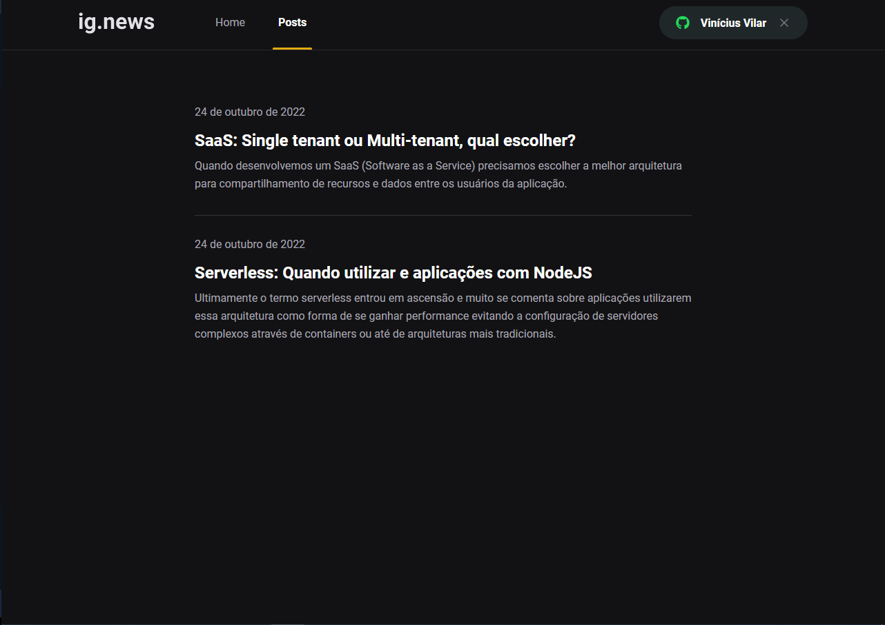
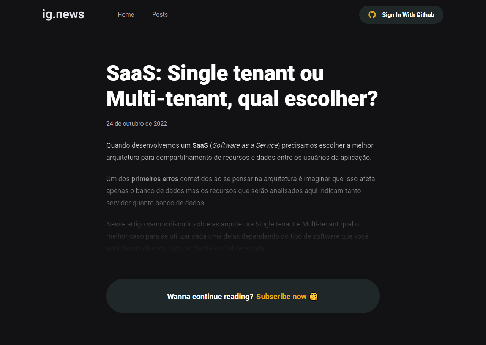
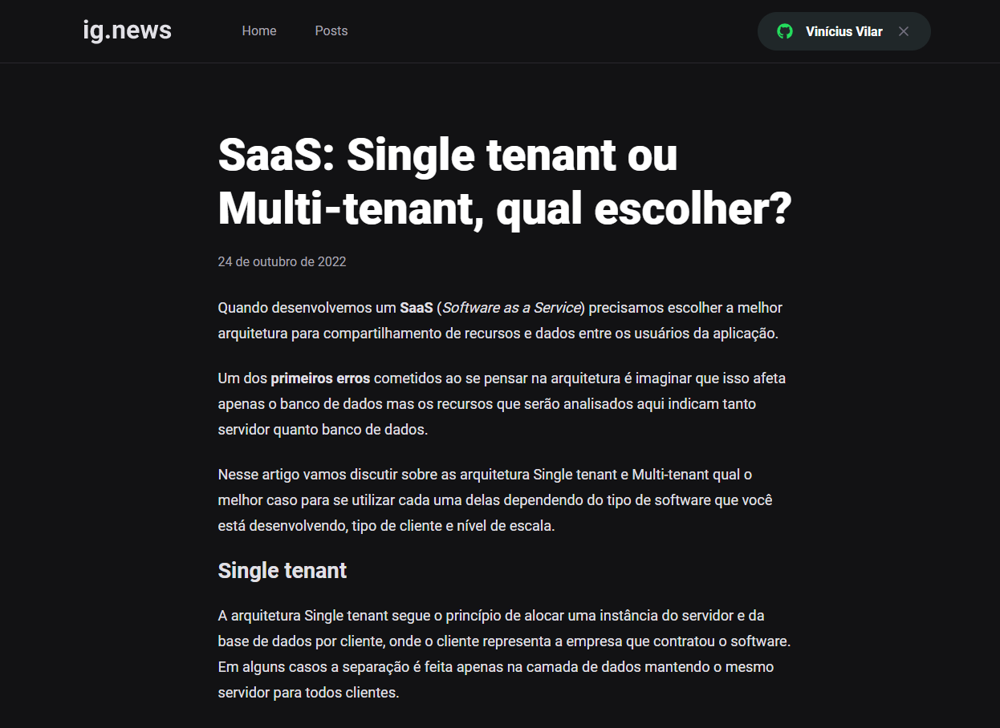

## Sobre

O ig.news é um plataforma de assinatura de conteúdo escrito.

Possui um sistema de assunatura integrado com o Stripe. O usuário que não possuir uma assinatura ativa, terá acesso apenas ao preview de cada conteúdo do site. O usuário com assinatura ativa possui acesso completo ao blog. Os dados do usuário (incluindo informações sobre assinatura) ficam salvos no banco de dados FaunaDB

A autenticação é feita usando o NextAuth.js.

Os posts são feito no CMS Prismic.

## Imagens

  
  
  
  

## Tecnologias usada

* Next.js
* Typescript
* NextAuth.js
* Prismic CMS
* Stripe
* FaunaDB

## Requerimentos

* Node
* Yarn

## Testando

* git clone https://github.com/viniciusvilar/ignews.git
* cd ignews
* yarn dev
